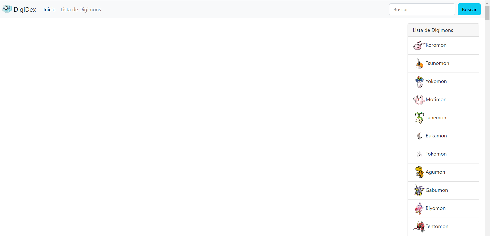
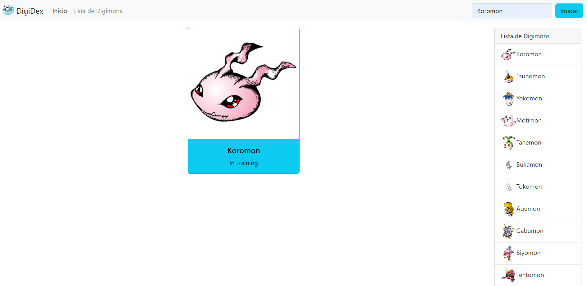
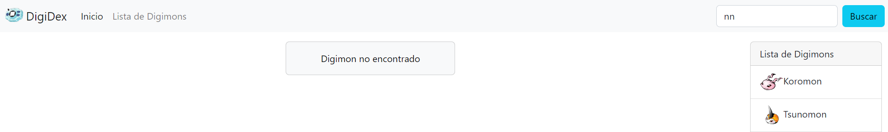
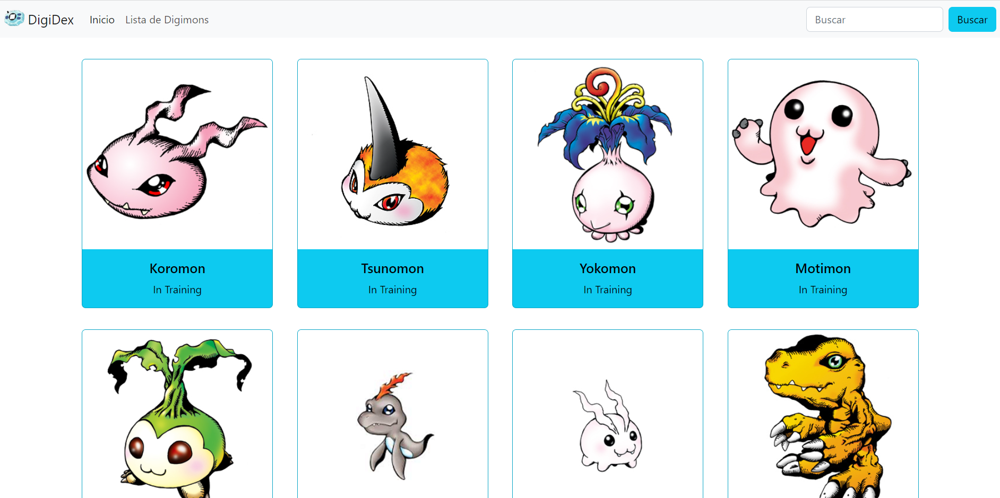
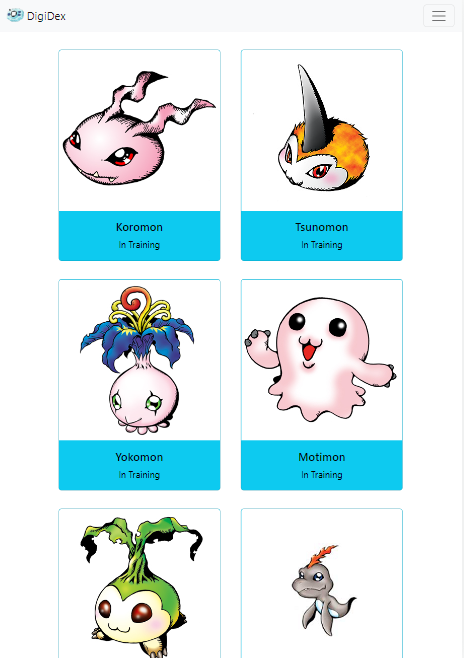

# Requerimientos

1. Deberás consumir la API gratuita Digimon
2. Al ingresar al enlace entregado deberás evaluar cual es la ruta correspondiente para poder realizar el ejercicio.
3. Deberás mostrar el nombre, la imagen y el nivel del Digimon.
4. Mostrarás un listado de Digimon y a la vez, el usuario podrá observar uno específicamente.
5. El diseño de la página es libre, pero deberá contar con una barra de navegación, al menos dos eventos, ser agradable a la vista y adaptarse a distintos tamaños de pantallas.

# Desarrollo

## Inicio

## Búsqueda

## Búsqueda no encontrada

## Listar

## Adaptativo

